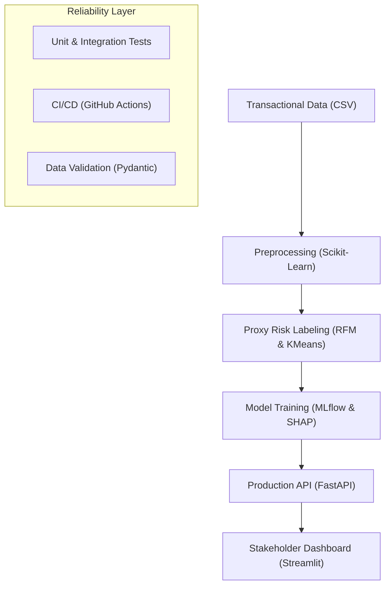

# Credit Risk Probability Model for Alternative Data

[](https://github.com/your-username/Credit-Risk-Probability-Model-for-Alternative-Data/actions/workflows/ci.yml)
[](https://www.python.org/downloads/release/python-3100/)
[](https://fastapi.tiangolo.com/)

## 📈 Strategic Overview
This project delivers a **robust, production-grade credit scoring system** designed for financial institutions entering the Buy-Now-Pay-Later (BNPL) space. By leveraging alternative transactional data, it identifies default risk patterns where traditional credit history is absent.

### Business Objective
- **Risk Mitigation**: Identify high-risk segments early to optimize capital allocation.
- **Financial Inclusion**: Provide credit access to "thin-file" customers using behavioral proxies.
- **Regulatory Compliance**: Adhere to Basel II principles via model interpretability (SHAP).

## 🏗️ Solution Architecture
The system is built with a modular, scalable architecture ensuring maintainability and high availability.



## 🛠️ Tech Stack & Engineering Excellence
- **ML/DS**: `Scikit-learn`, `Xverse` (WOE), `SHAP` (Explainability), `KMeans` (Proxy Labeling).
- **Engineering**: `FastAPI` (Async API), `Pydantic` (Data Validation), `Streamlit` (Interactive Analytics).
- **Ops**: `MLflow` (Experiment Tracking), `Docker` (Containerization), `GitHub Actions` (CI/CD).
- **Quality**: `Pytest`, `Mypy` (Static Typing), `Black` (Formatting), `Flake8` (Linting).

## 📊 Business Impact
- **Transparent Decisioning**: SHAP-based local explanations explain *why* a customer was rejected, crucial for regulatory transparency.
- **Reliable Pipeline**: Integrated CI/CD ensures that only tested, linted, and type-checked code reaches production.
- **Scalable Scoring**: Batch scoring capability allows processing thousands of applications per second via optimized API endpoints.

## 🚀 Quick Start

### 1. Installation
```bash
pip install -r requirements.txt
```

### 2. Run the API
```bash
uvicorn src.api.main:app --reload
```

### 3. Launch Dashboard
```bash
streamlit run src/dashboard.py
```

## 📜 Regulatory Note (Basel II)
In accordance with Basel II, this model prioritizes interpretability. The transition from behavioral proxies to actual default data is handled via a modular training pipeline, allowing for seamless recalibration as historical repayment data accumulates.

---
*Developed with a focus on precision, reliability, and business impact for the finance sector.*
